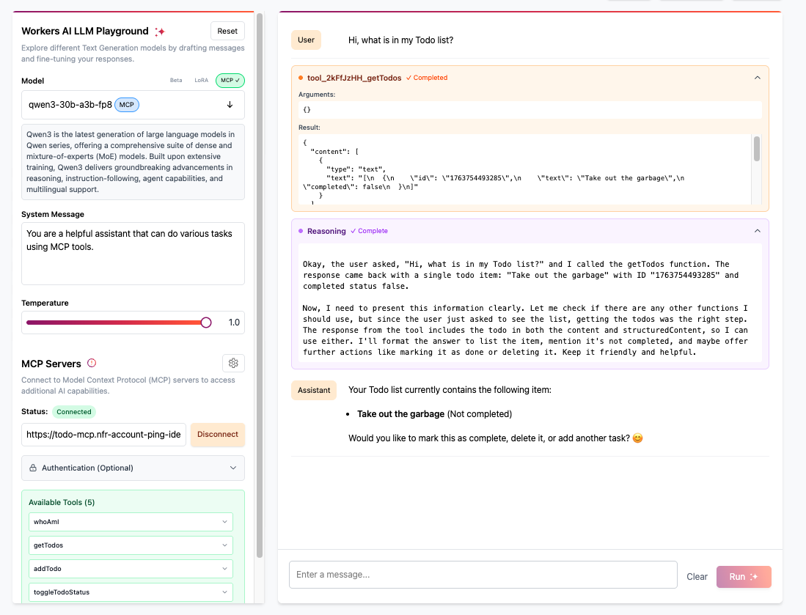

# Model Context Protocol (MCP) Server + PingOne

This is a [Model Context Protocol (MCP)](https://modelcontextprotocol.io/introduction) server that supports remote MCP connections, with PingOne built-in.

The MCP server (powered by [Cloudflare Workers](https://developers.cloudflare.com/workers/)):

- Acts as _OAuth Server_ to your MCP clients
- Acts as _OIDC Client_ to your PingOne environment

> [!WARNING]
> This is a demo template designed to help you get started quickly. While we have implemented several security controls, **you must implement all preventive and defense-in-depth security measures before deploying to production**. Please review our comprehensive security guide: [Securing MCP Servers](https://github.com/cloudflare/agents/blob/main/docs/securing-mcp-servers.md)

## Getting Started

This demo shows how an MCP server can securely call a protected API on behalf of an end user. To begin:

1. Deploy the [Todo API](./api/).
2. Deploy either the [OIDC MCP server](./mcp/) (for Cloudflare-managed consent) or the [DaVinci OIDC MCP Server](./mcp-dv/) (for PingOne DaVinci-managed consent).

> [!NOTE]
> The API used here could be any PingOne-secured API. We use a Cloudflare workers API for this example, but the goal is to demonstrate how any API can be connected to an MCP server using this architecture.

### Access the remote MCP server from the Cloudflare Workers AI LLM Playground

Navigate to [https://playground.ai.cloudflare.com](https://playground.ai.cloudflare.com) and connect to your MCP server using the following URL pattern:

```
https://remote-mcp-pingone(-dv).<your-subdomain>.workers.dev/mcp
```



### Access the remote MCP server from Claude Desktop

Open Claude Desktop and navigate to Settings -> Developer -> Edit Config. This opens the configuration file that controls which MCP servers Claude can access.

Replace the content with the following configuration. Once you restart Claude Desktop, a browser window will open showing your OAuth login page. Complete the authentication flow to grant Claude access to your MCP server. After you grant access, the tools will become available for you to use. 

```
{
  "mcpServers": {
    "todo-mcp": {
      "command": "npx",
      "args": [
        "mcp-remote",
        "https://remote-mcp-pingone(-dv).<your-subdomain>.workers.dev/mcp"
      ]
    }
  }
}
```

Once the Tools (under 🔨) show up in the interface, you can ask Claude to use them. For example: "Could you tell me what is in my Todo list?". Claude should invoke the tool and show the result generated by the MCP server.

## How does it work?

This architecture bridges the stateless nature of Cloudflare workers with the stateful requirements of an authenticated MCP session.

### OAuth Provider (The Identity Broker)

The OAuth provider library implements a compliant OAuth 2.1 server directly within your Cloudflare worker. It acts as the security gateway, performing a dual role:
- **OAuth Server:** It manages the immediate relationship with the MCP client, handling registration and issuing session tokens.
- **OIDC Client:** It orchestrates the upstream federation with PingOne, exchanging authorization codes for the access tokens needed to call protected APIs.

### Cloudflare Agents (Stateless Transport)

The MCP server implements the stateless MCP SDK v2 pattern (`createMcpHandler` + server factory, via the [Cloudflare Agents SDK](https://developers.cloudflare.com/agents)):
- **Stateless Operation:** A fresh MCP server instance is created per request — no Durable Object, no protocol session. The MCP 2026-07-28 protocol revision carries version, capabilities, and identity on every request, so nothing needs to be remembered between requests.
- **Per-Request Authentication:** The OAuth provider resolves the session for each request and injects the authenticated session (`props`, containing the PingOne token) into the MCP handler's execution context.
- **Network Transport:** Standard Streamable HTTP over the single `/mcp` endpoint.

### MCP SDK v2 (Tool Logic)

The `@modelcontextprotocol/server` SDK (v2) is used to define the actual capabilities of the MCP server. Each per-request McpServer instance:
- **Handles Protocol:** Manages the serialization of JSON-RPC messages and tool definitions.

## Use Cases & Extensibility

This architecture demonstrates a pattern for connecting AI agents to APIs secured by PingOne. By functioning as an OAuth proxy, the MCP server enables LLMs to interact with services on behalf of an authenticated user, without modifying the downstream API's existing permission models. Whether using the direct Cloudflare consent approach or the DaVinci orchestration flow, this project provides a configuration guide for enabling natural language interactions with enterprise data while maintaining identity-based access controls.
